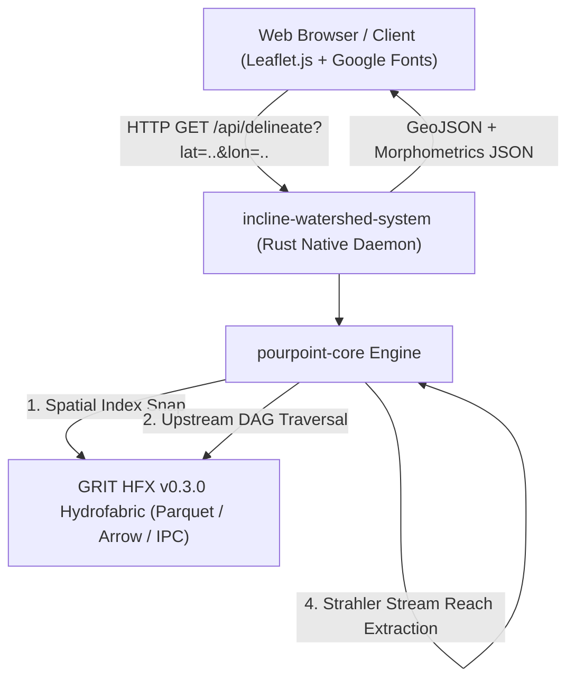

# INCLINE Watershed Delineation System

[](LICENSE)
[](https://www.rust-lang.org/)
[]()
[](https://github.com/CooperBigFoot/pourpoint)
[](https://incline.iitmandi.ac.in)

> **High-performance, publication-grade hydrographic watershed delineation and morphometric analysis engine for Indian river basins and global hydrography, powered by the [`pourpoint`](https://github.com/CooperBigFoot/pourpoint) engine (by Nicolas Lazaro).**

Developed for **INCLINE (IIT Mandi)**, this system extends the `pourpoint` hydrographic engine to perform instantaneous watershed delineation, river network stream routing, and rigorous scientific morphometric characterization in **sub-100 milliseconds**.

---

## Key Capabilities

- **Blazing Fast Delineation**: Computes complete dissolved basin polygons and upstream stream networks in **15–80 milliseconds** using pre-indexed directed acyclic graph (DAG) topology.
- **Scientifically Audited Morphometrics**: Computes 10+ peer-reviewed geomorphic parameters (Horton, Strahler, Schumm, Miller, Gravelius, Smith, Faniran) with exact formulas and published classifications.
- **Batch CSV Delineation & ZIP Packaging**: Delineate hundreds of river basins simultaneously via CSV upload with 1-click batch download containing individual GeoJSONs, combined GeoJSON, and comparative summary CSV.
- **Official CWC Hydrological Station Integration**: Includes verified station coordinates from the **Central Water Commission (CWC) Flood Forecast System** (Narmada, Yamuna, Gomti, Vaigai, Kopili, Cauvery).
- **Embedded Zero-Dependency Binary**: The entire web portal, styling, and Leaflet/Carto mapping engine are compiled directly into a single self-contained native binary.
- **Multi-Format GIS Export**: Export basins as GeoJSON Polygons, Stream LineStrings, Google Earth KML, and Publication-grade CSV Reports.
- **Google Maps-Style Basemap Switcher**: Floating interactive basemap selector supporting Satellite Imagery, Topographic Terrain, OpenStreetMap, CartoDB Positron, and Dark Matter.

---

## System Architecture



---

## Scientifically Audited Morphometric Parameters

All indices are computed using exact WGS84 geodesic algorithms (Karney / Vincenty):

| Parameter | Symbol | Scientific Formula | Unit | Primary Citation | Geomorphic Significance |
| :--- | :---: | :---: | :---: | :--- | :--- |
| **Basin Area** | $A$ | $\iint dA$ | $\text{km}^2$ | Horton (1932) | Total planimetric catchment area contributing runoff. |
| **Geodesic Perimeter** | $P$ | $\oint ds$ | $\text{km}$ | Schumm (1956) | Exact WGS84 geodesic perimeter along basin divide. |
| **Basin Length** | $L_b$ | $\max(d_{\text{geodesic}}(\text{outlet}, v))$ | $\text{km}$ | Schumm (1956) | Longest geodesic distance from outlet to perimeter. |
| **Form Factor** | $R_f$ | $R_f = \frac{A}{L_b^2}$ | dimensionless | Horton (1932) | Shapes hydrograph: low (< 0.4) indicates elongated basin with flatter peak flood. |
| **Circularity Ratio** | $R_c$ | $R_c = \frac{4 \pi A}{P^2}$ | dimensionless | Miller (1953) | Degree of circularity (0 to 1); indicates structural control and flashiness. |
| **Elongation Ratio** | $R_e$ | $R_e = \frac{2}{L_b}\sqrt{\frac{A}{\pi}}$ | dimensionless | Schumm (1956) | Classified into Circular (>0.9), Oval (0.8–0.9), Less Elongated (0.7–0.8), Elongated (<0.7). |
| **Compactness Constant** | $C_c$ | $C_c = \frac{P}{2\sqrt{\pi A}}$ | dimensionless | Gravelius (1914) | Ratio of perimeter to circumference of circle of equal area. Circle = 1.0. |
| **Drainage Texture Ratio** | $R_t$ | $R_t = \frac{N_1}{P}$ | $\text{km}^{-1}$ | Smith (1950) | Number of 1st-order streams per km perimeter. Classified Very Coarse to Very Fine. |
| **Bifurcation Ratio** | $R_b$ | $R_b = \frac{N_u}{N_{u+1}}$ | dimensionless | Strahler (1957) | Branching index; typically 3.0 to 5.0 for natural dendritic basins. |
| **Drainage Intensity** | $D_i$ | $D_i = \frac{F_s}{D_d}$ | $\text{km}^{-1}$ | Faniran (1968) | Ratio of stream frequency to drainage density; measure of erosion susceptibility. |

---

## Project Structure

```text
incline_watershed_system/
├── Cargo.toml                       # Root Cargo workspace & package definition
├── Cargo.lock                       # Pinned dependencies for reproducible server builds
├── README.md                        # Documentation & deployment guide
├── LICENSE                          # MIT open source license
├── .gitignore                       # Git ignore configuration
├── run.sh                           # Production launch script
├── config.env.example               # Template environment configuration
├── crates/
│   └── core/                        # pourpoint-core high-performance hydrographic library
│       ├── Cargo.toml
│       ├── src/
│       │   ├── algo/
│       │   │   ├── channel_length.rs      # Stream reach geometry & Strahler order
│       │   │   ├── watershed_perimeter.rs # Exact WGS84 geodesic perimeter
│       │   │   └── upstream.rs            # DAG network traversal
│       │   └── engine.rs
├── src/
│   ├── main.rs                      # Native web server & REST API handler
│   └── portal.html                  # Responsive GIS web application
├── data/
│   └── sample_cwc_stations.csv      # CWC verified hydrological stations sample CSV
└── deploy/
    ├── Dockerfile                   # Multi-stage production container build
    ├── incline-watershed.service    # Linux systemd service unit template
    └── nginx.conf.example           # Nginx reverse proxy with SSL & gzip compression
```

---

## Quick Start (Local Development)

### 1. Requirements
- **Rust Toolchain**: 1.85+ (`curl --proto '=https' --tlsv1.2 -sSf https://sh.rustup.rs | sh`)
- **Hydrofabric Dataset**: GRIT HFX v0.3.0 directory or remote URL.

### 2. Build and Run
```bash
# Clone the repository
git clone https://github.com/Barbhuiya12/watershed_delineation.git
cd watershed_delineation

# Run with local dataset
./run.sh /path/to/grit-hfx-v0.3.0
```

Open `http://127.0.0.1:8787` in any web browser.

---

## Server Deployment Guide

### Option 1: Linux Systemd Daemon (Recommended)

1. Copy repository to server directory:
   ```bash
   sudo git clone https://github.com/Barbhuiya12/watershed_delineation.git /opt/incline-watershed-system
   cd /opt/incline-watershed-system
   sudo cargo build --release --bin incline-watershed-system
   ```

2. Configure environment:
   ```bash
   sudo cp config.env.example /etc/incline-watershed.env
   sudo nano /etc/incline-watershed.env
   # Set: INCLINE_DATASET_PATH=/opt/datasets/grit-hfx-v0.3.0
   ```

3. Install systemd service:
   ```bash
   sudo cp deploy/incline-watershed.service /etc/systemd/system/
   sudo systemctl daemon-reload
   sudo systemctl enable --now incline-watershed
   sudo systemctl status incline-watershed
   ```

### Option 2: Docker Container

```bash
docker build -t incline-watershed:latest -f deploy/Dockerfile .

docker run -d \
  --name incline-watershed \
  -p 8787:8787 \
  -v /opt/datasets/grit-hfx-v0.3.0:/data/grit-hfx-v0.3.0:ro \
  incline-watershed:latest
```

### Option 3: Nginx Reverse Proxy & SSL

```bash
sudo cp deploy/nginx.conf.example /etc/nginx/sites-available/incline-watershed
sudo ln -s /etc/nginx/sites-available/incline-watershed /etc/nginx/sites-enabled/
sudo certbot --nginx -d watershed.incline.iitmandi.ac.in
sudo systemctl reload nginx
```

---

## REST API Reference

### 1. Dataset Metadata
```http
GET /api/meta
```
**Response (200 OK):**
```json
{
  "system": "INCLINE Watershed Delineation System",
  "institution": "IIT Mandi",
  "dataset": "/Users/.../grit-hfx-v0.3.0",
  "open_seconds": 1.15
}
```

### 2. Delineate Watershed & Streams
```http
GET /api/delineate?lat={latitude}&lon={longitude}&level=all&downstream=reaches
```

| Parameter | Type | Required | Description |
| :--- | :---: | :---: | :--- |
| `lat` | `float` | **Yes** | Outlet latitude in decimal degrees (WGS84). |
| `lon` | `float` | **Yes** | Outlet longitude in decimal degrees (WGS84). |
| `level` | `string` | No | `all` (complete upstream basin) or `unit` (terminal unit only). |
| `downstream` | `string` | No | `reaches` (include detailed stream network geometry) or `none`. |
| `strategy` | `string` | No | `weight` (channel size first, default) or `distance` (nearest channel). |
| `radius` | `float` | No | Channel search radius in meters (defaults to adaptive ladder 1–50 km). |

**Response (200 OK):**
Returns a comprehensive GeoJSON bundle with dissolved watershed polygon, Strahler-classified reach network, timing diagnostics, and morphometric indices.

---

## Batch Processing Schema

The system accepts CSV files for multi-basin delineations. The file must include `latitude` and `longitude` columns:

```csv
basin_code,basin_name,latitude,longitude,river_name,state
CWC_01,Mandla Station,22.5980,80.3710,Narmada,Madhya Pradesh
CWC_02,Old Railway Bridge,28.6650,77.2480,Yamuna,Delhi
CWC_03,Gomti Barrage,26.8520,80.9590,Gomti,Uttar Pradesh
CWC_04,Madurai Station,9.9250,78.1210,Vaigai,Tamil Nadu
CWC_05,Kampur Station,26.0280,92.8120,Kopili,Assam
CWC_06,Musiri Station,10.9410,78.4480,Cauvery,Tamil Nadu
```

Click **Export All (ZIP)** to download:
- Individual GeoJSON polygons for each watershed (`{basin_code}_boundary.geojson`)
- Individual GeoJSON stream networks (`{basin_code}_streams.geojson`)
- Merged watershed boundary collection (`all_watersheds_combined.geojson`)
- Comprehensive summary CSV containing areas, coordinates, and computation times.

---

## Attribution & Upstream Credits

This system builds upon and extends the exceptional open-source work of:

- **[`pourpoint`](https://github.com/CooperBigFoot/pourpoint)** by **Nicolas Lazaro**:
  The core hydrographic delineation engine powering the topological directed acyclic graph (DAG) traversals, spatial unit resolution, HFX catchment reading, and polygon union algorithms. We extend `pourpoint` with publication-grade morphometric indices (Horton, Strahler, Schumm, Miller, Gravelius, Smith, Faniran), exact WGS84 geodesic perimeter integration, stream reach extraction, batch CSV processing, and an interactive GIS web platform.
- **[Upstream Tech](https://upstream.tech/)**:
  Developers of the **GRIT (Global River Hydrofabric)** dataset specification and the `hfx` crate.
- **[Central Water Commission (CWC)](https://ffs.india-water.gov.in/)**, Ministry of Jal Shakti, Government of India:
  For official river basin gauge station benchmarks and flood forecasting reference coordinates across Indian river basins.

---

## Citation

If you use this software for research or operational hydrologic forecasting, please cite both this system and the underlying `pourpoint` engine:

```bibtex
@software{incline_watershed_2026,
  author = {{INCLINE Hydrology Group, IIT Mandi}},
  title = {INCLINE High-Performance Watershed Delineation and Morphometric Analysis System},
  year = {2026},
  publisher = {GitHub},
  url = {https://github.com/Barbhuiya12/watershed_delineation}
}

@software{pourpoint_lazaro_2026,
  author = {Lazaro, Nicolas},
  title = {pourpoint: High-performance watershed delineation engine},
  year = {2026},
  publisher = {GitHub},
  url = {https://github.com/CooperBigFoot/pourpoint}
}
```

*Built with Rust, pourpoint core, GRIT Hydrofabric, and Leaflet.js.*
